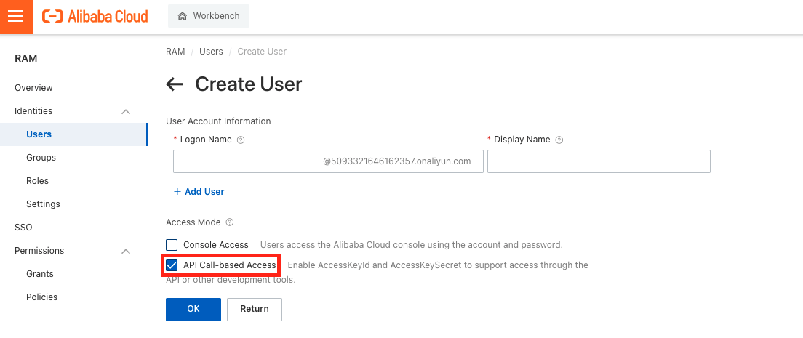

# **阿里云域名**
利用阿里云域名配置个人服务器

---

## **Overview**

- [**阿里云域名**](#阿里云域名)
  - [**Overview**](#overview)
  - [**购买阿里云域名**](#购买阿里云域名)
  - [**域名解析到服务器IP地址**](#域名解析到服务器ip地址)
    - [**有固定IP——直接绑定**](#有固定ip直接绑定)
    - [**无固定IP——绑定之后再动态解析**](#无固定ip绑定之后再动态解析)

---
## **购买阿里云域名**

1. **注册阿里云账号**  
   前往[阿里云国际版网站](https://www.alibabacloud.com/)，注册境外账号（可以免除实名认证之类的麻烦）。

2. **查询和购买域名**
    - 前往[国际版阿里云域名市场](https://www.alibabacloud.com/domain?spm=a2c5t.10695662.1996646101.searchclickresult.1b6e1074QlVBYx)，搜索想要注册的次级域名，如“jinli”。

    - 搜索结果会显示所有可用的域名：
    

    - 用注册的阿里云账号购买需要的域名，如“jinli.cyou”。

---

## **域名解析到服务器IP地址**

- 购买的域名需要解析到服务器的IP地址才能直接通过域名访问服务器。
- 如果服务器具有固定IP，只需要在阿里云上将域名和服务器绑定即可。
- 如果服务器没有固定IP，则需要将域名动态解析到服务器的IP地址。

### **有固定IP——直接绑定**

1. **获取IP地址**
   - 可以前往[IPv6测试网站](https://test-ipv6.com/)查看网络是否支持IPv6：
     

   - 如果是类Unix系统，可以通过如下命令获取IPv4地址：
        ```shell
        curl ipinfo.io/ip
        ```
     通过如下命令获取IPv6地址：
        ```shell
        curl ipv6.icanhazip.com
        ```

2. **将域名与IP地址绑定**
   - 登录[阿里云国际版网站](https://www.alibabacloud.com/)，点击右上角用户头像，在下拉菜单选择Account Management。
     
   - 鼠标移到左上角菜单栏，会出现下拉菜单，点击“Domains”。
     
   - 在域名列表点击你购买的域名。
   - 点击右侧菜单“DNS Settings”。
   - 点击“Add Record”来绑定域名和IP：
     
     - Type：如果是IPv4地址，选择“A”；如果是IPv6地址，选择“AAAA”。
     - Host：输入需要绑定的三级域名地址，例如想要设置“surface.jinli.cyou”，就填入“surface”。关于更多域名名称的设置说明，可以点击后面的问号查看。
     - ISP Line：选default。
     - Value：输入你在上一步获取的IP地址（IPv4或IPv6与“Type”对应）。
     - TTL：IP地址刷新的时间间隔，默认的10分钟就行。
   - 你可以绑定多个域名和IP，IPv4和IPv6都行。

3. **测试是否绑定成功**
  绑定完成后可能需要10分钟的时间等待阿里云DNS服务器完成更新（一般提交之后立刻就会更新）。然后可以查看是否绑定成功。
   - 建议在另一个网络环境通过“ping”命令测试
     ```shell
     ping surface.jinli.cyou
     ```
     如果可以在公网ping通，则绑定成功。

4. **完成！**
  绑定成功之后就可以通过域名来访问服务器了，例如如果需要使用*ssh*远程登录服务器，就可以直接*ssh*域名：
    ```shell
    ssh lijin@surface.jinli.cyou -X
    ```
    也可以用服务器搭建NAS（Network Attached Storage）服务等，然后通过域名访问。

### **无固定IP——绑定之后再动态解析**

如果电脑或服务器没有固定IP地址，则需要先按照上面的步骤在阿里云上绑定当前的IP地址。然后监控本机IP地址，一旦发生改变，就通过阿里云提供的API上传到阿里云DNS服务器，修改原来绑定的IP地址。

- 使用一个Python3脚本来完成DNS动态解析
- 脚本使用了阿里云开放的API
- 需要使用你阿里云账户生成的Access key来免密码登录你的阿里云账户
- 为了账户安全，千万不要公开你的Access key。Access key一旦泄露，立刻登录你的阿里云账户删除该Access key。

1. **下载DDNS脚本**
   - DDNS(Dynamic Domain Name System)，即动态域名解析的脚本参考了GitHub上的[aliyun-ddns-client](https://github.com/rfancn/aliyun-ddns-client)。在美国使用该项目有两个问题：
     - 源项目提供的用来获取IP地址的网站在美国无法使用
     - 对IPv6的支持有一些问题
   - 因此我fork了此项目，并修复了存在的问题，仓库地址：[https://github.com/jin-li/aliyun-ddns-client](https://github.com/jin-li/aliyun-ddns-client)
   - 该DDNS脚本使用Python3运行
   1) 使用如下命令克隆仓库到本地，建议放在~/.config目录下（如果home下没有.config文件夹，则先创建该文件夹）：
      ```shell
      cd ~/.config
      git clone https://github.com/jin-li/aliyun-ddns-client
      ```
   2) 安装依赖的Python库 `requests` 和 `netifaces`
      - 如果使用[Anaconda](https://www.anaconda.com/products/individual)作为Python的包管理工具，则使用以下命令：
        ```shell
        conda activate
        conda install requests
        conda install netifaces
        ```
      - 如果使用[pip3](https://pip.pypa.io/en/stable/getting-started/)作为Python的包管理工具，则使用以下命令：
        ```shell
        pip3 install requests
        pip3 install netifaces
        ```
2. **在阿里云账户生成Access key**
   - 登录阿里云账户，点击左上角的菜单，在菜单里找到*Management and Governance*中的*Resource Access Management*：
      
   - 进入RAM页面后，点击左侧菜单栏里*Identities*中的*Users*，然后点击*Create User*新建一个账户。填入Logon Name和Display Name，勾选API Call-based Access以便使用API登录账户：
      
   - 新建用户之后回到RAM/Users页面，点击刚才新建的用户名，进入User设置页面。下拉到页面底部，点击*User AccessKeys*中的*Create AccessKey Pair*按钮，生成你的AccessKey。记录下弹出的Access ID 和 Access Key。注意，Access Key只会出现一次，当你关闭弹出的页面后就会消失，不过你可以重复创建。
3. **配置并运行脚本**
   - 进入你刚才下载的aliyun-ddns-client文件夹，找到文件`ddns.conf.example`，将其重命名为`ddns-conf`。
   - 用文本编辑器打开该文件（`ddns.conf`），填入你在上一步获取的Access ID 和 Access Key。再填入你想要解析的域名和对应的IP地址（IP地址正确与否不重要，如果错误的话，待会儿运行本脚本后会把它改正；但域名一定要是你在之前“有固定IP——直接绑定”第2步中创建的域名）。
   - 如果你有多个域名需要解析，可以仿照`ddns.conf`中已有的例子自行添加域名，IPv4和IPv6都支持。再次强调，本文件中需要解析的域名需要是之前在“有固定IP——直接绑定”第2步中在阿里云上已经创建的域名。
     
   - 然后就可以用Python3运行本脚本了：
     ```shell
     python3 ddns.py
     ```
   - 脚本每次运行时都会检测当前IP和阿里云DNS服务器上域名对应的IP是否相同，若不相同则会更新阿里云DNS服务器上的IP地址。
4. **设置定时任务**
   - 如果电脑/服务器无固定IP，那么IP每隔一段时间就会改变，我们需要在IP改变之后尽快更新阿里云DNS服务器上的IP记录。
   - 人工监控IP变化不太方便，我们可以每隔一段时间（例如每小时）让系统自动运行一次DDNS脚本，这样我们就可以做到在IP改变之后一小时内更新。
   - 类Unix系统中的定时任务可以使用系统程序[`crontab`](https://man7.org/linux/man-pages/man5/crontab.5.html)实现，你可以在[这里](https://crontab.guru/#)看到一些设置`crontab`的方法。
   - 例如我们想要在每个小时的第42分钟运行该DDNS脚本，我们可以在命令行输入以下命令：
     ```shell
     crontab -e
     ```
     此命令会打开一个包含`crontab`定时任务的配置文件，在文件末尾加入一行
     ```shell
     42 * * * * cd ~/.config/aliyun-ddns-client ipython3 ddns.py
     ```
     即可。
   - 之后可以使用如下命令查看`crontab`定时任务是否在运行：
     ```shell
     crontab -l
     ```