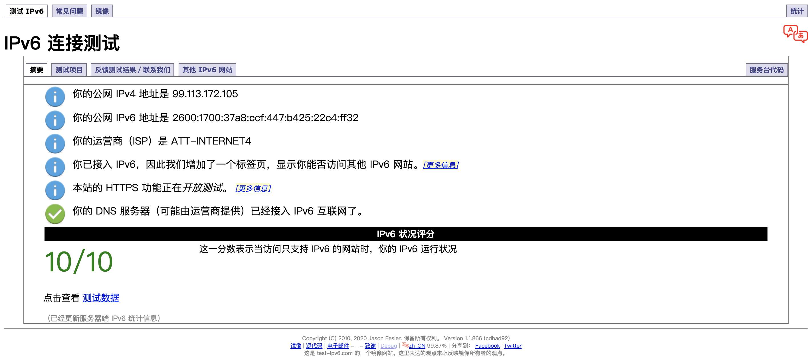

# **阿里云域名**
利用阿里云域名配置个人服务器

---

## **购买阿里云域名**

1. **注册阿里云账号**  
   前往[阿里云国际版网站](https://www.alibabacloud.com/)，注册境外账号（可以免除实名认证之类的麻烦）。

2. **查询和购买域名**
    - 前往[国际版阿里云域名市场](https://www.alibabacloud.com/domain?spm=a2c5t.10695662.1996646101.searchclickresult.1b6e1074QlVBYx)，搜索想要注册的次级域名，如“jinli”。

    - 搜索结果会显示所有可用的域名：
    

    - 用注册的阿里云账号购买需要的域名，如“jinli.cyou”。

---

## **域名解析到服务器IP地址**

- 购买的域名需要解析到服务器的IP地址才能直接通过域名访问服务器。
- 如果服务器具有固定IP，只需要在阿里云上将域名和服务器绑定即可。
- 如果服务器没有固定IP，则需要将域名动态解析到服务器的IP地址。

### **有固定IP——直接绑定**

1. **获取IP地址**
   - 可以前往[IPv6测试网站](https://test-ipv6.com/)查看网络是否支持IPv6：
     

   - 如果是类Unix系统，可以通过如下命令获取IPv4地址：
        ```shell
        curl ipinfo.io/ip
        ```
     通过如下命令获取IPv6地址：
        ```shell
        curl ipv6.icanhazip.com
        ```

2. **将域名与IP地址绑定**
   - 登录[阿里云国际版网站](https://www.alibabacloud.com/)，点击右上角用户头像，在下拉菜单选择Account Management。
     
   - 鼠标移到左上角菜单栏，会出现下拉菜单，点击“Domains”。
     
   - 在域名列表点击你购买的域名。
   - 点击右侧菜单“DNS Settings”。
   - 点击“Add Record“来绑定域名和IP：
     
     - Type：如果是IPv4地址，选择“A”；如果是IPv6地址，选择“AAAA”。
     - Host：输入需要绑定的三级域名地址，例如想要设置“surface.jinli.cyou”，就填入“surface”。关于更多域名名称的设置说明，可以点击后面的问号查看。
     - ISP Line：选default。
     - Value：输入你在上一步获取的IP地址（IPv4或IPv6与“Type”对应）。
     - TTL：IP地址刷新的时间间隔，默认的10分钟就行。

3. **测试是否绑定成功**
  绑定完成后可能需要10分钟的时间等待阿里云DNS服务器完成更新（一般提交之后立刻就会更新）。然后可以查看是否绑定成功。
   - 建议在另一个网络环境通过“ping”命令测试
     ```shell
     ping surface.jinli.cyou
     ```
     如果可以在公网ping通，则绑定成功。

4. **完成！**
  绑定成功之后就可以通过域名来访问服务器了，例如如果需要使用*ssh*远程登录服务器，就可以直接*ssh*域名：
    ```shell
    ssh lijin@surface.jinli.cyou -X
    ```
    也可以用服务器搭建NAS（Network Attached Storage）服务等，然后通过域名访问。

### **无固定IP——绑定之后再动态解析**

如果电脑或服务器没有固定IP地址，则需要先按照上面的步骤在阿里云上绑定当前的IP地址。然后监控本机IP地址，一旦发生改变，就通过阿里云提供的API上传到阿里云，修改原来绑定的IP地址。

- 使用一个Python2脚本来完成DNS动态解析
- 脚本使用了阿里云开放的API
- 需要使用你阿里云账户生成的Access key来免密码登录你的阿里云账户
- 为了账户安全，千万不要公开你的Access key。Access key一旦泄露，立刻登录你的阿里云账户删除该Access key。

1. **下载DDNS脚本**
2. **在阿里云账户生成Access key**
3. **运行脚本**
4. **设置定时任务**