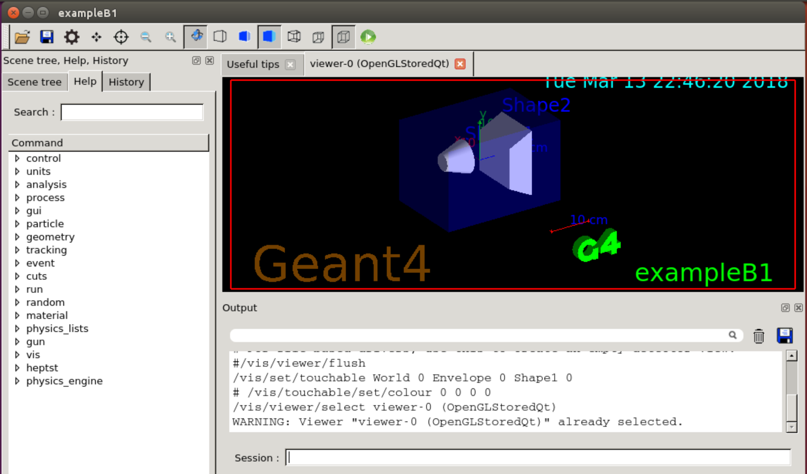

# **GEANT4**
在WSL（Bash on Ubuntu on Windows）下的GEANT4安装，Qt图形界面  
参考[GEANT4官方网站安装说明](http://geant4.web.cern.ch/geant4/UserDocumentation/UsersGuides/InstallationGuide/html/gettingstarted.html)



## **Prerequisite**
- CMake 3.3 or higher
- gcc 4.8.4 or higher
- Qt5 or Qt4
- OpenGL 相关库
- X11 相关库

## **Install**
1. **安装依赖库**
    Ubuntu 16.04 下使用如下命令
    ```shell
    $ sudo apt-get install cmake libx11-dev libxext-dev libxtst-dev libxrender-dev libxmu-dev  libxmuu-dev
    ```
2. **安装Qt5**
    Ubuntu 16.04 下使用如下命令
    ```shell
    $ sudo apt-get install qt5-default qtcreator
    ```
    此方法比较简单，但不保证安装的版本最新。若需要安装相关文档及示例，可执行以下命令
    ```shell
    $ sudo apt-get install qt5-doc
    $ sudo apt-get install qt5-doc-html qtbase5-doc-html
    $ sudo apt-get install qtbase5-examples
    ```
3. **下载源码和数据文件**
    在[GEANT4官网](http://geant4.web.cern.ch/geant4/support/download.shtml)下载源码及数据文件。源码版本目前是GEANT4 10.4.1，数据文件共11个包，建议全部下载。然后将源码解压至 ~/Desktop/geant4.10.04，数据文件全部解压至 ~/Desktop/data 。  

4. **准备编译与安装的文件夹**
    假设安装目录是 /usr/local/geant4-install，编译目录是 ~/Desktop/geant4-build。创建编译目录
    ```shell
    $ cd ~/Desktop
    $ mkdir geant4-build
    ```
    无需创建安装目录，安装目录将在安装时自动创建。但注意使用 /usr/local/geant-install 作为安装目录时，普通用户没有权限在 /usr/local 创建文件夹，需使用sudo。
5. **使用CMake和make编译GEANT4源码**
    使用CMake编译时有一些编译选项，详见[官网安装说明](http://geant4.web.cern.ch/geant4/UserDocumentation/UsersGuides/InstallationGuide/html/installguide.html)。这里使用了如下命令
    ```shel
    $ cd geant4-build
    $ cmake -DCMAKE_INSTALL_PREFIX=/usr/local/geant4-install/ -DGEANT4_USE_OPENGL_X11=ON -DGEANT4_USE_RAYTRACER_X11=ON -DGEANT4_USE_QT=ON GEANT4_BUILD_MULTITHREADED=ON ../geant4.10.04
    ```
    注意各路径的正确。其中各选项含义如下  

    | 选项                          | 意义             |
    | :---------------------------: | :--------------: |
    | -DCMAKE_INSTALL_PREFIX        | 指定安装目录     |
    | -DGEANT4_USE_OPENGL_X11=ON    | 开启OpenGL和X11  |
    | -DGEANT4_USE_RAYTRACE_X11     | 径迹追踪使用X11  |
    | -DGEANT4_USE_QT=ON            | 使用QT           |
    | GEANT4_BUILD_MULTITHREADED=ON | 编译时使用多线程 |
  
    CMake之后使用make编译源码  

    ```shell
    $ make -j4
    ```  

    -j4 在此处意为编译时使用4个线程，可根据电脑核数自行指定。
    
    *本人电脑上编译大概耗时2小时*

6. **安装**
    ```shell
    $ sudo make install -j4
    ```
    注意上述命令执行时的目录依然是 ~/Desktop/geant4-build 。此处使用sudo的原因是提供在 /usr/local 下创建文件夹的权限。安装成功后终端会出现类似如下的信息
    > --Configuring done
    > --Generating done
    > --Build files have been written to: /usr/local/geant4-install
7. **测试运行**
    安装完成之后可使用GEANT4自带的示例进行测试。
    - 首先将第3步中下载解压的数据文件移动到    /usr/local/geant4-install/share/Geant4-10.4.1 下  
        
        ```shell
        $ sudo mv ~/Desktop/data /usr/local/geant4-install/share/Geant4-10.4.1
        ```
    - **设置环境变量**。  设置环境变量的脚本是 /usr/local/geant4-install/share/Geant4-10.4.1/geant4make/geant4make.sh ，每次运行GEANT4前先运行此脚本以设置环境变量
        ```shell
        $ source /usr/local/geant4-install/share/Geant4-10.4.1/geant4make/geant4make.sh
        ``` 
        为了方便可将此命令加入 ~/.bashrc 。
    - 进入 /usr/local/geant4-install/share/Geant4-10.4.1/examples/basic/B1 并编译示例文件
        ```shell
        $ cd /usr/local/geant4-install/share/Geant4-10.4.1/examples/basic/B1
        $ make
        ```
    - 若上一步报错
      > Creating shared library /home/lijin/geant4_workdir/tmp/Linux-g++/exampleB1/libexampleB1.so ...  
      > /usr/bin/ld: cannot find -lQtCore  
      > /usr/bin/ld: cannot find -lQtGui  
      > /usr/bin/ld: cannot find -lQtCore  
      > /usr/bin/ld: cannot find -lQtGui  
      > /usr/bin/ld: cannot find -lQtOpenGL  
      > collect2: error: ld returned 1 exit status  
      > /usr/local/geant4-install/share/Geant4-10.4.1/geant4make/config/common.gmk:49: recipe for target '/home/lijin/geant4_workdir/tmp/Linux-g++/exampleB1/libexampleB1.so' failed  
      > make: *** [/home/lijin/geant4_workdir/tmp/Linux-g++/exampleB1/libexampleB1.so] Error 1

      说明未找到Qt的动态链接库文件 libQtCore.so，libQtGui.so，libQtOpenGL.so。实际上相应的文件均存在于 /usr/lib/x86_64-linux-gnu 内，但由于安装的是Qt5，所以实际的文件名与上述略有差异。为解决此问题可创建软连接
      ```shell
      $ ln -s /usr/lib/x86_64-linux-gnu/libQtCore.so /usr/lib/x86_64-linux-gnu/libQt5Core.so
      $ ln -s /usr/lib/x86_64-linux-gnu/libQtGui.so /usr/lib/x86_64-linux-gnu/libQt5Gui.so
      $ ln -s /usr/lib/x86_64-linux-gnu/libQtOpenGL.so /usr/lib/x86_64-linux-gnu/libQt5OpenGL.so
      ```
      然后再make即无报错。
    - **运行！**
      ```shell
      $ exampleB1
      ```
      成功运行的窗口如图：
      

---
安装时参考了网页：[GEANT4安装过程](https://leeyeel.github.io/2017/07/01/geant4-install/)