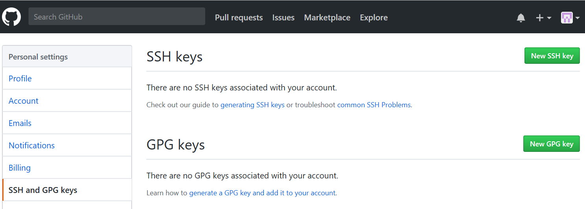

# **GitHub**
GitHub在Windows和WSL中的使用

## **GitHub在Windows PowerShell中的使用**

### **Prerequisite**
- Git installed
- PowerShell installed
### **Usage**
1. **使用PsGet安装PSGitHub插件**  
    ``` shell
    Install-Module -Name PSGitHub -Scope CurrentUser
    ```
2. **使用Git Bash在本地建立GitHub的ssh密钥**
    ``` shell
    ssh-keygen -t rsa -C "username@youremail.com" 
    ```  
    接着会提示让输一个passphrase，可直接Enter跳过。成功之后会显示生成的公钥保存的位置及指纹。公钥一般会保存在  
    > /mnt/c/Users/*name*/.ssh/id_rsa  
    > /mnt/c/Users/*name*/.ssh/id_rsa.pub
 
3. **添加公钥到GitHub账户**  
    登录GitHub，进入Settings，选择“SSH and GPG keys”，点击“New SSH key”，用文本编辑器打开上一步生成的“id_rsa.pub”文件，将里面的文本全部复制进去，点击“Add SSH key”  
      
    在Git Bash中输入
    ```shell
    ssh -T git@github.com
    ```
    回车后会提示是否连接，输入yes，若显示
    > Hi "username"! You're successfully authentiated,but GitHub does not provide shell access  
    
    则证明已配置成功。
4. **在PowerShell中建立GitHub口令**   
    使用PSGitHub插件的Set-GitHubToken，在PowerShell中输入  
    ```shell
    Set-GitHubToken
    ```
    按照提示输入用户名和密码。然后输入
    ```shell
    Get-GitHubAuthenticatedUser
    ```
    会得到报错
    > Invoke-RestMethod : The request was aborted: Could not create SSL/TLS secure channel.  

    执行命令
    ```shell
    [Net.ServicePointManager]::SecurityProtocol = [Net.SecurityProtocolType]::Tls12
    ```
    然后再“Get-AuthenticatedUser”即可。  
5. **使用PSGitHub插件直接新建远程仓库**  
    输入命令
    ```shell
    New-GitHubRepository
    ```
    根据提示输入仓库名等即可。
6. **远程仓库与本地仓库同步**
    在本地建立仓库并同步到远程仓库
    ```shell
    mkdir gitRepo
    cd gitRepo
    git init  #初始化本地仓库
    git add xxx  #添加要push到远程仓库的文件或文件夹
    git commit -m 'first commit'  #提交文件
    git push -u origin master #将本地仓库push到远程仓库，注意-u参数的使用
    ```

## **GitHub在WSL中的使用**
### **Prerequisite**
- WSL installed
- git installed
### **Usage**
由于已经在Windows上添加了GitHub的ssh密钥，WSL直接和Windows共用此密钥即可。
1. **WSL与Windows共用ssh密钥**
    由于WSL的home目录是"/home/*username*/"，而Windows的home目录是"/mnt/c/Users/*username*/"，可使用软链接将二者联系起来，在bash中执行以下命令
    ```bash
    ln -s /mnt/c/Users/*username*/.ssh/id_rsa ~/.ssh/id_rsa  
    ln -s /mnt/c/Users/*username*/.ssh/id_rsa.pub ~/.ssh/id_rsa.pub
    ```
    这样可以避免复制文件及权限问题。
2. **WSL上GitHub账户配置**  
    在bash中执行以下命令
    ```bash
    git config --global user.name username
    git config --global user.email user@useremail.com
    ```
3. **WSL上保存GitHub用户名和密码**  
    保存用户名和密码以免每次pull和push都需要输入
    ```bash
    git config --global credential.helper store
    ```
---
做完以上配置之后，从WSL进入本地GitHub仓库和从Windows进入本地GitHub仓库的效果就完全一样了，两个系统下GitHub仓库的状态也完全实现了同步。
